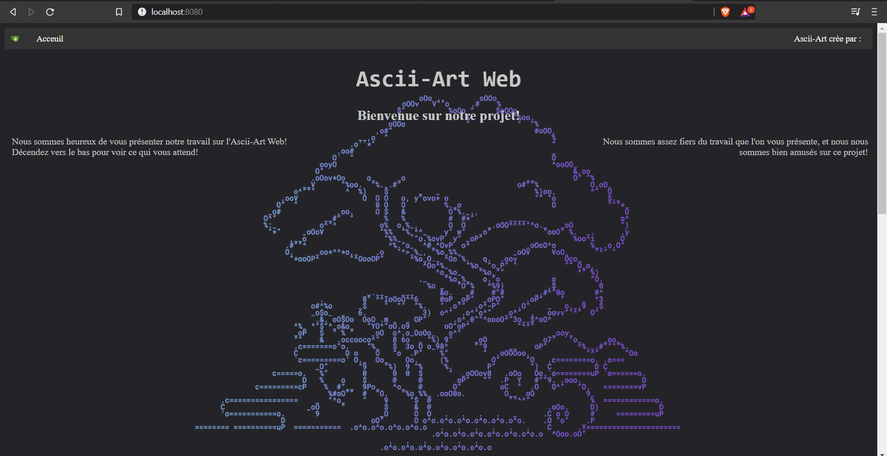
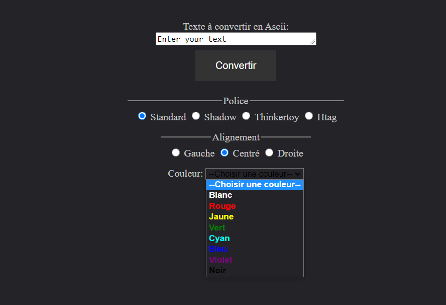
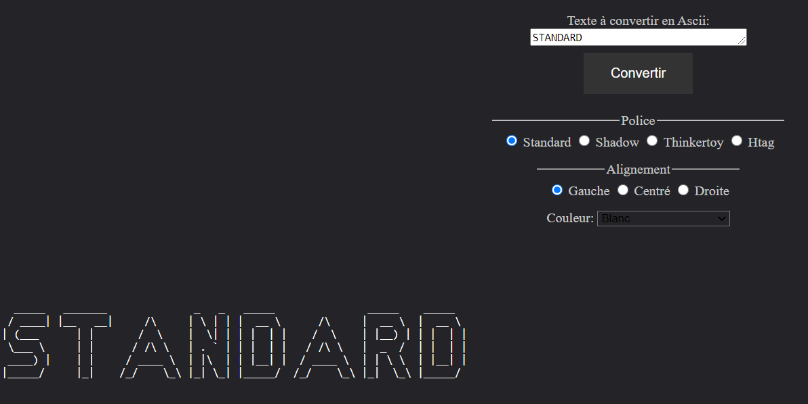
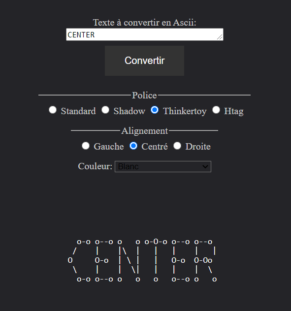
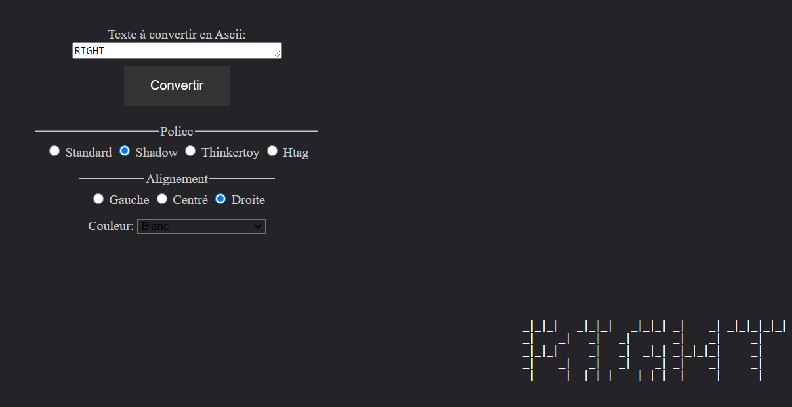
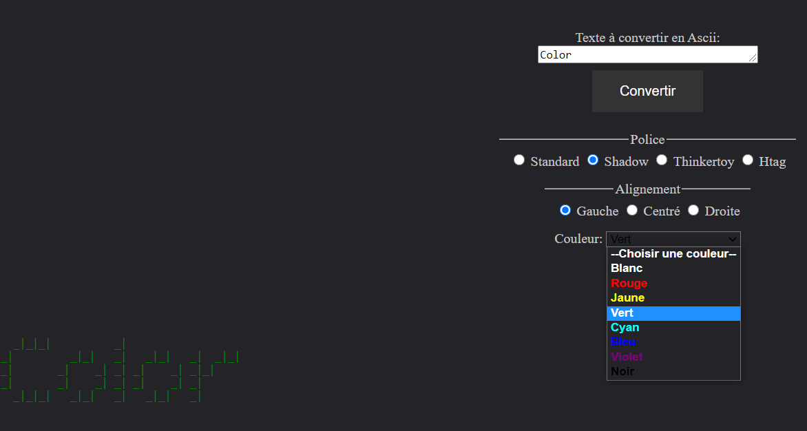
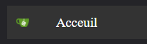
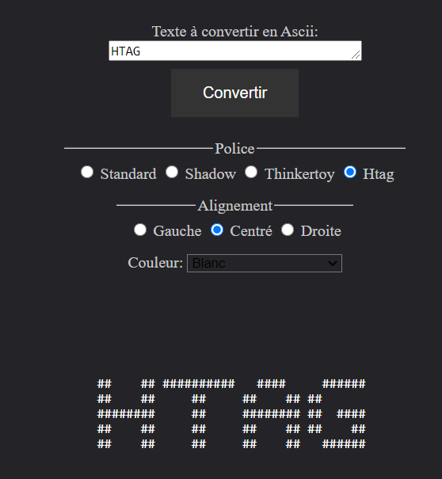
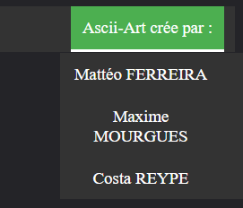

<--- README IN FRENCH -->

# 
 Ascii-Art-Web 
</u>

## Sommaire:

Cliquez ici pour voir le sommaire :

- [Groupe de développement](#groupe-de-développement)
- [Procédure d'installation du projet en local](#procédure-d-installation-du-projet-en-local)
- [Exemples d'utilisations](#exemples-d-utilisations)
- [Exploration du site](#exploration-du-site)

 

## Groupe de développement

Ce projet a été réalisé par plusieurs personnes :

- Maxime Mourgues
- Mattéo Ferreira
- Costa Reype

Nous nous sommes donc répartis les tâches de la manière suivante :

- Maxime nous a fourni une première version de la page en HTML avec un peu de CSS. Par la suite il a amélioré cette page afin d'en faire ce qu'elle est actuellement
- Mattéo a personnalisé le CSS et a amélioré le HTML (en faisant le bandeau par exemple).
- Costa a réalisé la synchronisation de l'HTML et du Golang afin de faire fonctionner l'ascii.

## Procédure d'installation du projet en local

- Dans un premier temps, il faudra télécharger tous les fichiers présents dans le dossier src, donc cela comprend :

  - src comprenant :
    - serveur.go
    - le dossier Police comprenant :
      - ascii-table-template.txt
      - shadow.txt
      - standart.txt
      - thinkertoy.txt
    - le dossier template comprenant :
      - Costa.html
      - Home.html
      - Mattéo.html
      - Maxime.html
      - le dossier assets comprenant :
        - profile.css,
        - stylesheet.css
        - le dossier img_assets :
          - Gitea_Logo.png
          - Kosta.jpg
          - Maksim.png
          - Matt&O.jpg
          - profile.png
          - tree.png

- Pour faire fonctionner notre site, il faudra se placer dans le dossier `src` et effectuer la commande `go run .\serveur.go`

- Ensuite, il faut taper dans la barre du navigateur `localhost:8080`

- Pour pouvoir convertir le texte, il suffit de le mettre dans la zone de texte et de choisir les modules que vous souhaitez, et de cliquer sur `Convertir`

- Vous pourrez donc admirer votre texte dans le bas de la page

## Exemples d'utilisations

Lors du lancement du site nous arrivons sur:  
  

Puis nous arrivons sur la partie la plus interréssante, la partie ascii: 
 

Nous pouvons observer 3 sélections possibles:

- 4 polices possibles (entre Standard, Shadow, Thinkertoy et Htag) 
   
- 3 centrages (gauche, centre et droite) 
   
   
- Plusieurs couleurs (rouge, jaune, vert ...) 
   

## Exploration du site

Nous avons ajouté des fonctionalités dans notre projet :

- Tout d'abord un bouton avec le logo de Gitea qui vous emmène directement sur le Gitea de notre projet.  
   
- Nous avons rajouté une police `Hashtag` qui affiche le texte composé d'Hashtags. 
   
- Nous avons également une partie de présentation des créateurs de ce projet, qui ouvre une autre page, et  
  qui incarne une brève description de nous et qui renseigne les difficultés rencontrées pour chacun  
   
